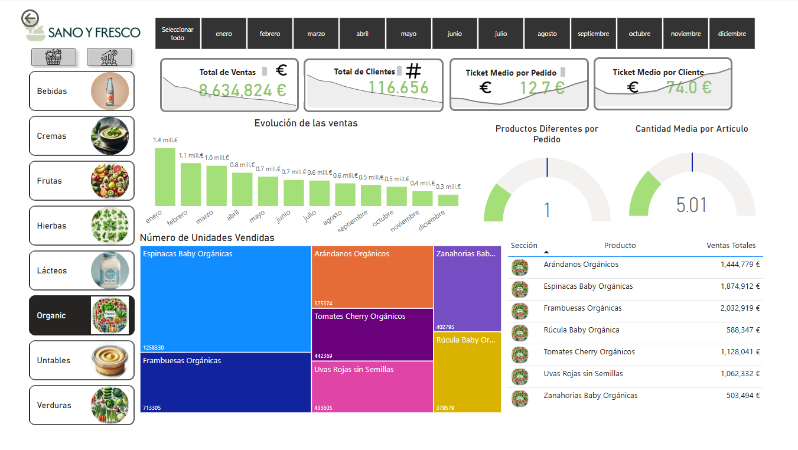

# 📊 Análisis de Comercio Minorista

## 📌 Descripción del Proyecto

Este proyecto tiene como objetivo analizar datos de ventas de un negocio minorista para identificar patrones de consumo, tendencias temporales y oportunidades de mejora en la toma de decisiones.

Se desarrolló un flujo completo de análisis de datos, desde la limpieza y exploración hasta la visualización en dashboard interactivo.

---

## 🎯 Objetivos

* Analizar el comportamiento de ventas
* Identificar productos y categorías más rentables
* Evaluar el comportamiento de cada categoría
* Generar insights accionables para negocio

---

## 🛠️ Tecnologías utilizadas

* **Python** (Pandas, NumPy, sqlite3)
* **Power BI** (visualización y dashboard)
* **Jupyter Notebook**
* **Git & GitHub**

---

## 🔄 Proceso del análisis

1. **Carga de datos**
2. **Análisis y transformación utilizando SQL**

   * Manejo de valores nulos
   * Conversión de tipos de datos
   * Distribuciones
   * Correlaciones
     
3. **Generación de KPIs**

   * Ventas totales
   * Ticket promedio
   * Productos más vendidos
5. **Visualización en dashboard**

---

## 📊 Dashboard

### 🔹 Vista General

### 🔹 Market Basket Analytics

Es una técnica utilizada en el ámbito del análisis de datos y la mineria de datos en el campo del comercio minorista y la gestión de ventas. El objetivo principal el decubrir patrones de asociacion entre productos que sulen ser comprados juntos por los clientes.

---

## 📈 Principales Insights

* El negocio ha generado 39.854.875,32 € en ingresos totales durante el año. 
* Se observa una tendencia decreciente significativa en los ingresos mensuales. 
* Existen categorías con alto volumen pero bajo margen de ganancia
* Es crucial implementar estrategias para revertir esta caída y diversificar las fuentes de ingresos para asegurar la sostenibilidad a largo plazo.

---

## 📊 Datos

Los datasets completos no se incluyen en este repositorio debido a su tamaño.

---

## 🚀 Visualizar Dashboard

1. https://app.powerbi.com/view?r=eyJrIjoiNGFiYmY2NGItMzA1Ny00Nzc2LWIxMzItN2QzNjAxNTM4MGFlIiwidCI6IjVmMjgyOTEwLTE3NmYtNDU5ZC1hYjdkLWI3NDRhYTZlZmMwNyIsImMiOjR9

---

## Autor

**Rodrigo Bautista**
.
